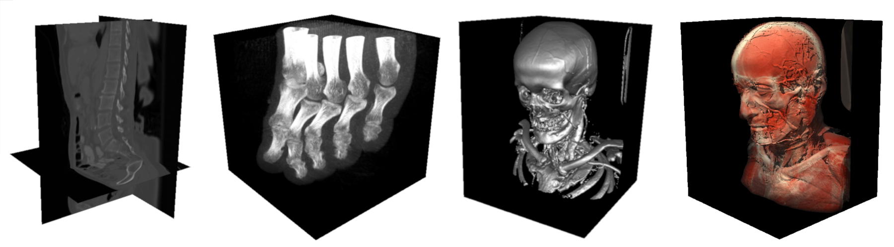

# Vol_viewer

A Volume viewer for visualization of medical images

## 1. DATA

Vol_viewer can load 3D images using the .vtk file format.

Images should be stored in the folder "Vol_viewer/data".

## 2. EXTERNAL DEPENDENCIES

All external dependencies are open-source libraries.

For convenience, they should be copied in a "Vol_viewer/external" folder (see [RT_lite](https://github.com/ludoBcg/RT_lite) ).

* [GLEW (The OpenGL Extension Wrangler Library)](http://glew.sourceforge.net/)
  
* [GLM (OpenGL Mathematics)](https://github.com/g-truc/glm)

* [GLFW (Graphics Library Framework)](https://www.glfw.org/)

* [Dear ImGui (Immediate-mode Graphical User Interface)](https://github.com/ocornut/imgui)

## 3. COMPILATION

Vol_viewer is provided as a ready-to-build folder with a CMakeList. 

## 4. SOURCES

* [1] J. Kruger and R. Westermann, “Acceleration Techniques for GPU-Based Volume Rendering,” Proceedings of the 14th IEEE Visualization, 2003, VIS '03, pp. 38-42.
* [2] https://learnopengl.com/PBR/Lighting
* [3] https://learnopengl.com/Advanced-Lighting/SSAO
* [4] M. Schnöller, "Real-Time Volume Rendering for Medical Images Visualization". Bsc. thesis, university of Innsbruck dpt. of computer science, 2021.
